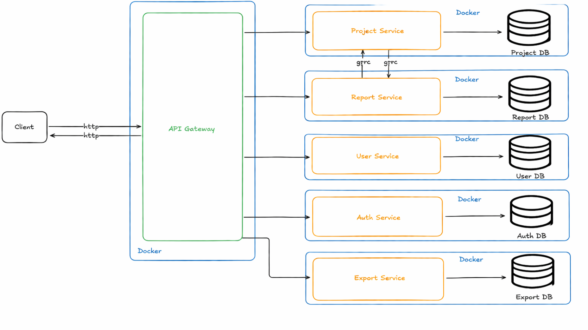

# Project Management

`project-management` — микросервисная CRM-система для управления проектами и отчётами, а также их выгрузкой в удобной форме (PDF, Excel, .CSV)

Текущий стек:
- Go
- PostgreSQL
- gRPC для внутренних взаимодействий между сервисами
- REST только на `gateway`
- Swagger / OpenAPI только для внешнего REST API `gateway`
- Docker Compose для локального запуска

## Архитектура


В системе используется схема `gateway -> gRPC services`:

- `gateway` — единственная внешняя точка входа по REST
- `auth-service` — учетные данные, JWT, роли, bootstrap admin
- `user-service` — профили пользователей
- `project-service` — проекты, этапы, участники, события
- `report-service` — ежедневные отчеты, строки отчета, комментарии
- `export-service` — экспорт отчётов в удобной для руководителя форме (PDF, Excel, .CSV)
- `payment-calendar-service` — формирование платежного календаря 
- `contracts` — `.proto`-контракты и сгенерированный Go-код для gRPC
- 
## Визуальная схема проекта (черновой вариант)




Важно:
- внешние клиенты общаются только с `gateway`
- внутренние сервисы не публикуют собственный REST API
- OpenAPI-спецификация поддерживается только для `gateway`
- `.proto` в `contracts` являются источником истины для внутренних gRPC-контрактов

## Что умеет система

- регистрация и логин пользователей
- выдача и проверка JWT
- разграничение прав `user` / `admin`
- хранение профилей пользователей отдельно от учетных данных
- управление проектами, этапами, участниками и событиями проекта
- фиксация ежедневной работы сотрудников по проектам и этапам
- ревью отчетов руководителем проекта
- экспорт отчетов в PDF, Excel, .CSV
- формирование платёжного календаря
- Swagger UI для внешнего REST API

## Актуальная структура репозитория

```text
project-management/
  auth-service/
  contracts/
  export-service/
  gateway/
  images/ - схема приложения
  payment-calendar-service/
  project-service/
  report-service/
  user-service/
  docker-compose.yaml
  Makefile
  README.md
```

## Публичные и внутренние интерфейсы

| Компонент                  | Интерфейс | Назначение                                   |
|----------------------------| --- |----------------------------------------------|
| `gateway`                  | REST | внешний API для клиентов                     |
| `auth-service`             | gRPC | аутентификация, авторизация, JWT             |
| `user-service`             | gRPC | профиль пользователя                         |
| `project-service`          | gRPC | проектная структура                          |
| `report-service`           | gRPC | ежедневная отчетность                        |
| `export-service`           | gRPC | выгрузка отчётности                          |
| `payment-calendar-service` | gRPC | формирование платежного календаря  |

## Конфигурация: YAML или переменные окружения

Сейчас проект использует гибридную схему конфигурации:

- у каждого сервиса есть базовый файл `configs/config.yaml`
- сервисы читают конфиг через `cleanenv`
- значения из переменных окружения могут переопределять YAML

На практике:

- секреты и environment-specific значения лучше задавать через env / secrets manager, а не хардкодить в YAML

Но в этом проекте используется такая модель:

- структура конфигурации задается в `configs/config.yaml`
- `docker-compose.yaml` переопределяет адреса сервисов, строки подключения к БД и bootstrap admin через env

То есть отдельный `.env.example` сейчас не обязателен. Если позже захочешь упростить перенос между окружениями, можно добавить `.env` только как слой значений для Compose, но сами сервисы уже умеют работать без него.

## Порты по умолчанию в Docker Compose

| Компонент                  | Внутри сети Docker | Снаружи хоста |
|----------------------------| --- |---------------|
| `gateway`                  | `:8080` | `28080`       |
| `auth-service`             | `:8080` | `28081`       |
| `project-service`          | `:8080` | `28082`       |
| `user-service`             | `:8080` | `28083`       |
| `report-service`           | `:8080` | `28084`       |
| `payment-calendar-service` | `:8080` | `28085`       |
| `export-service`           | `:8080` | `28086`       |
| `pgAdmin`                  | `:80` | `18888`       |

Внешним клиентам обычно нужен только `gateway` на `http://localhost:28080`.

## Быстрый старт

### Требования

- Go 1.25+
- Docker Desktop
- `make`
- `protoc` для работы с `contracts`
- Git Bash или WSL, если ты запускаешь `make` на Windows и хочешь использовать POSIX-команды из `Makefile`

### 1. Установить инструменты

```bash
make tools
```

### 2. Сгенерировать Swagger для `gateway`

```bash
make swagger
```

Эта команда генерирует:
- `gateway/api/swagger.json`
- `gateway/api/swagger.yaml`

### 3. Поднять проект

```bash
make up
```

Или напрямую:

```bash
docker compose up --build -d
```

### 4. Открыть документацию

- Swagger UI: [http://localhost:28080/swagger/index.html](http://localhost:28080/swagger/index.html)
- OpenAPI JSON: [http://localhost:28080/openapi/swagger.json](http://localhost:28080/openapi/swagger.json)
- OpenAPI YAML: [http://localhost:28080/openapi/swagger.yaml](http://localhost:28080/openapi/swagger.yaml)

## Swagger / OpenAPI

Актуальное правило такое:

- Swagger поддерживается только для `gateway`
- документация описывает только внешний REST API
- внутренние gRPC-сервисы не документируются через OpenAPI
- для внутренних контрактов источником истины служат `.proto`-файлы в `contracts/proto`

Если меняется внешний REST API:

1. обновляешь handler-комментарии в `gateway`
2. запускаешь `make swagger`
3. пересобираешь `gateway`

## Базовый сценарий работы системы

1. Клиент отправляет REST-запрос в `gateway`
2. `gateway` проверяет JWT и права доступа
3. `gateway` вызывает нужные внутренние gRPC-сервисы
4. Сервисы работают со своими БД и возвращают ответ обратно в `gateway`
5. `gateway` формирует итоговый REST-ответ

## Полезные ссылки

- Контракты gRPC: [contracts/README.md](contracts/README.md)
- Gateway: [gateway/README.md](gateway/README.md)
- AuthService: [auth-service/README.md](auth-service/README.md)
- UserService: [user-service/README.md](user-service/README.md)
- ProjectService: [project-service/README.md](project-service/README.md)
- ReportService: [report-service/README.md](report-service/README.md)
- PaymentCalendarService: TODO
- ExportService: TODO
